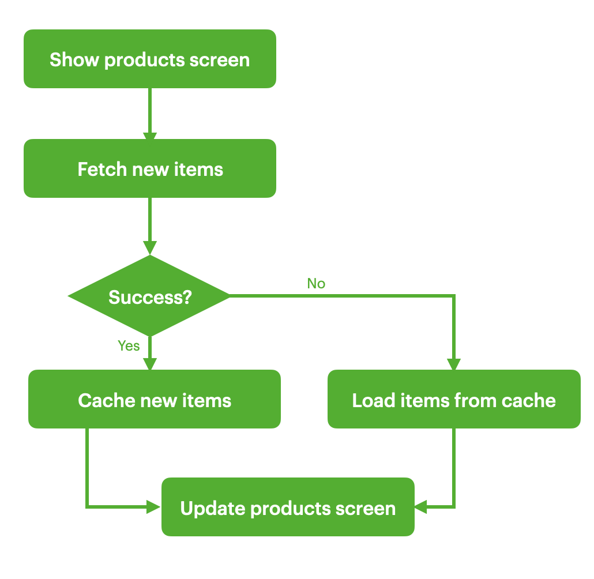
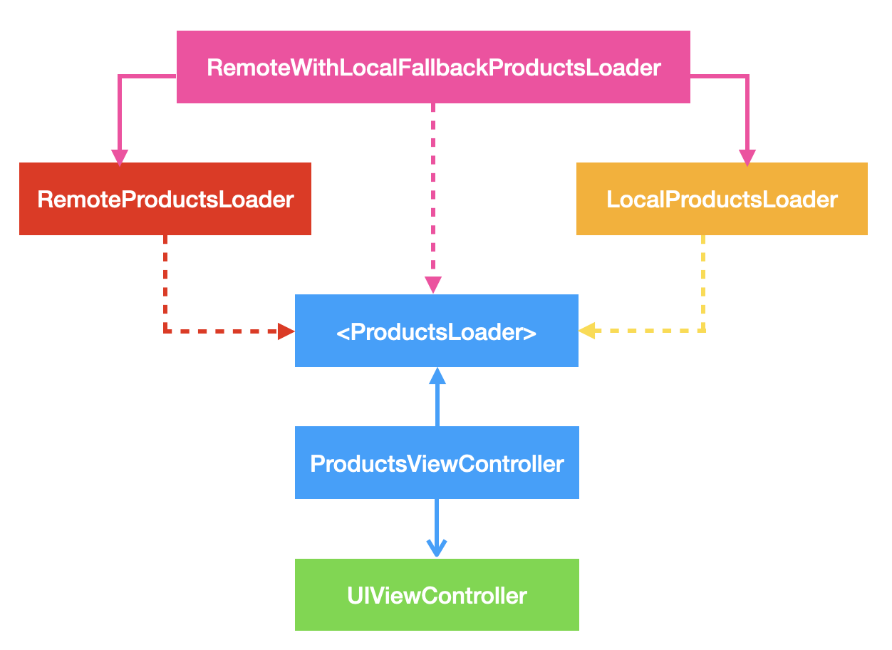

# BDD Specs

## Story: Customer requests to see the products

### Narrative #1:
> As an online customer, <br> 
> I want the app to automatically load the latest products with their images, so I can always enjoy browsing the newest products.

#### Scenarios (Acceptance Criteria):
**Given** the customer has connectivity<br>
**When** the customer requests to see the products<br>
**Then** the app should display the latest products from the remote server<br>
    **And** replace the cache with the new products<br>

### Narrative #2:
> As an offline customer, <br> 
> I want the app to show the latest saved version of the products with their images, so I can always enjoy browsing the latest products.

#### Scenarios (Acceptance Criteria):
**Given** the customer does not have connectivity<br>
**When** the customer requests to see the products<br>
**Then** the app should display the latest products saved with their images<br>

**Given** the customer does not have connectivity<br>
**Given** the cache is empty<br>
**When** the customer requests to see the products<br>
**Then** the app should display an error message<br>

# Use Cases

## Use Case: Load Products

### Data:
- URL

### Primary Course (happy path):
1. Execute “Load Products” command with above data
2. System downloads data from the URL
3. System validates downloaded data
4. System creates product items from valid data
5. System delivers product items

### Invalid data - error course (sad path):
1. System delivers error

### No connectivity - error course (sad path):
1. System delivers error

## Use Case: Load Products Fallback (Cache)

### Data:
- Max age

### Primary Course (happy path):
1. Execute “Retrieve Products” command with above data
2. System fetches products data from the cache
3. System creates product items from cache
4. System delivers product items

### No cache course (sad path):
1. System delivers error

## Use Case: Save Product Items

### Data:
- Product Items

### Primary Course (happy path):
1. Execute “Save Product Items” command with above data
2. System fetches product items
3. System timestamps the new cache
4. System replaces old cache with the new data
5. System delivers success message

### Fails to cache (sad path):
1. System displays an error

## Flowchart


## Architecture


## Model Specs
### Product
| Property | Type    |
|----------|---------|
| id       | Int     |
| title    | String  |
| price    | Double  |
| description | String (optional) |
| category   | String  |
| image      | URL  |

### Payload contract
```
GET *url* (TBD)
200 Response

[
    {
      "id": 1,
      "title": "a title",
      "price": 109.95,
      "description": "a description",
      "category": "a category",
      "image": "https://some-image-2.jpg"
    },
    {
      "id": 2,
      "title": "another title",
      "price": 22.3,
      "category": "another category",
      "image": "https://some-image-2.jpg"
    }
]
```
